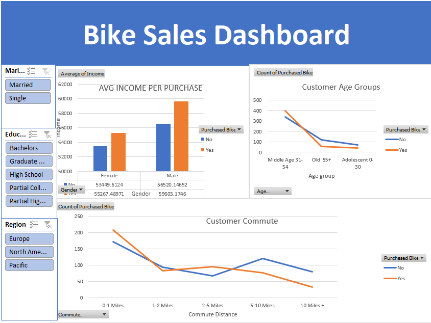

# 📊 Bike Sales Dashboard Analysis (Excel Project)

---

## 📌 Project Overview
This project focuses on **data cleaning, analysis, and dashboard creation using Microsoft Excel**.  
The objective was to transform raw bike sales data into an **interactive dashboard** that delivers meaningful business insights about customer purchasing behavior.

---

## 🎯 Objectives
- Clean and standardize raw sales data
- Perform exploratory data analysis (EDA)
- Analyze customer demographics and buying patterns
- Build an interactive Excel dashboard
- Present insights using visual storytelling

---

## 🛠️ Tools & Technologies
- Microsoft Excel
- Pivot Tables
- Pivot Charts
- Data Cleaning Techniques
- Slicers & Filters
- Data Visualization
- Exploratory Data Analysis (EDA)

---

## 🧹 Data Cleaning Process
- Removed duplicate records
- Standardized categorical values (Gender, Marital Status, etc.)
- Formatted income and numerical columns
- Fixed inconsistent text using Find & Replace
- Created derived columns such as Age Groups

---

## 📈 Dashboard Features
The dashboard provides interactive analysis of:

- 🚴 Bike purchases by **Income Level**
- 👨‍👩‍👧 Customer distribution by **Age Group**
- 🌍 Regional purchase trends
- 🚗 Effect of **Commute Distance**
- 👥 Demographic-based buying behavior

### Dashboard Components
- Pivot Tables
- Dynamic Charts
- Slicers for real-time filtering
- Interactive visual summaries

---

## 📊 Key Insights
- Customers with higher income showed higher purchase rates.
- Middle-aged customers were the primary buyers.
- Commute distance influenced purchase decisions.
- Regional analysis highlighted strong sales markets.

---

## 📂 Project Structure
```
Bike-Sales-Dashboard/
│
├── BikeSalesDataset.xlsx
└── README.md
```

---

## 🚀 How to Use
1. Download the repository files.
2. Open `dashboard.xlsx` using Microsoft Excel (2016 or later).
3. Navigate to the **Dashboard Sheet**.
4. Use slicers to filter and explore insights.

---

## 📷 Dashboard Preview
(Add your screenshot inside repo)

```

```

---

## 💡 Learning Outcomes
- Real-world Excel data analysis workflow
- Data cleaning and preprocessing skills
- Dashboard design principles
- Business insight generation
- Data storytelling using visualization

---
